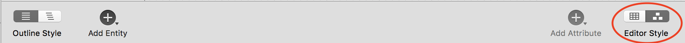
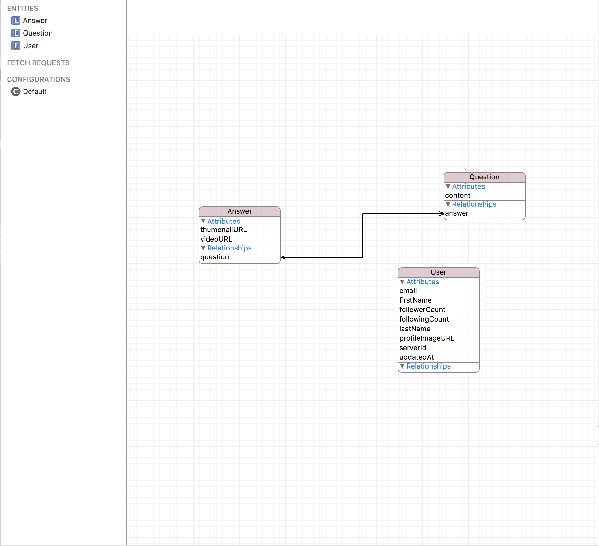
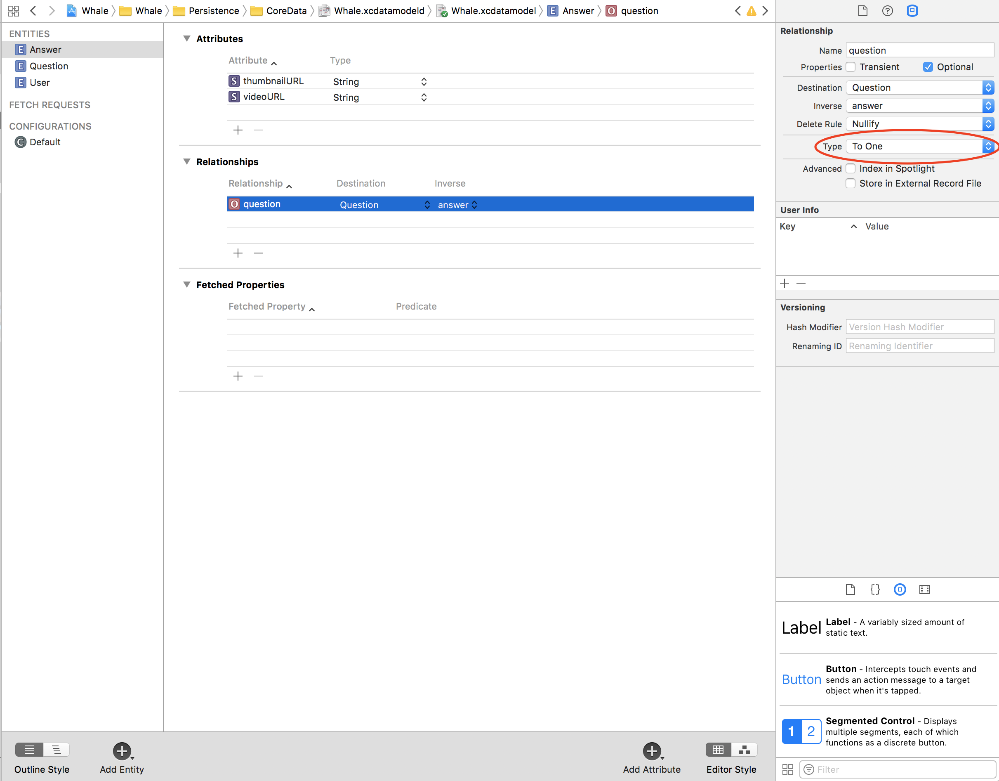
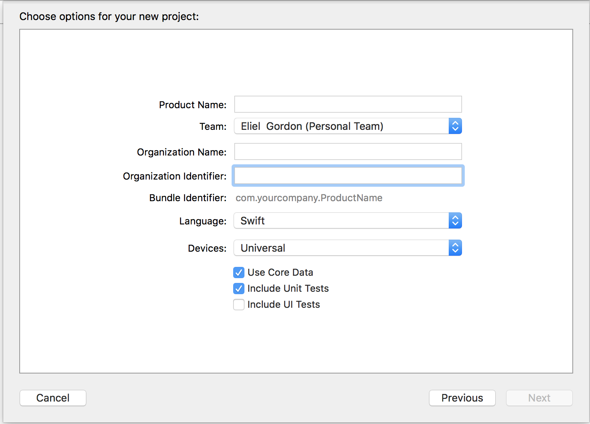

# Persitence - Intro to Core Data

### Objectives
- Modeling and persisting objects with core data
- Fetch user data by performing queries
- Synchronizing data

## Terminologies
- Persisted Store
- Core data object/model
- Core data stack
- Migration
- Queries

## Intro to Core Data

Core data is an object graph that allows you to persist and query on data.

Allows you to perform migrations, establish deletion rules etc.

It isn't a database in of itself.

> Core Data provides an infrastructure for change management and
for saving objects to and retrieving them from storage. It can use
SQLite as one of its persistent store types. It is not, though, in and of
itself a database. (To emphasize this point: you could for example
use just an in-memory store in your application. You could use Core
Data for change tracking and management, but never actually save
any data in a file.) - Apple

### Benefits

- Provides a query interface to search through persisted
objects 

- Provides advanced features such as migrations, delete rules,
etc.

- Allows us to work with (almost) regular Swift objects and
persist them 

### Types of Stores

- SQLite
- In memory
- XML

### CoreData Stack

**NSManagedObject** - Temporary representation of an object in the object
store.

**NSManagedObjectContext** - Primary interface between application code
and Core Data. Provides a scratchpad for changes to the object store.
When you fetch objects from the persisted store, you work on temporary copies of those persistence objects before saving.

**NSPersistentStoreCoordinator** - Hides implementation details of Persistent
Object Store from NSManagedObjectContext.

**NSPersistentStore** - actual storage


### NSManagedObject

A temporary representation of a Object in the persistent store

All ManagedObjects need to be registered with one ManagedObjectContext
You can create custom Managed Object Subclasses

### NSManagedObjectContext

A scratchpad for changes to persisted Objects

We fetch ManagedObjects from a ManagedObjectContext

We create new ManagedObjects within a ManagedObjectContext

An NSManagedObjectContext can be saved, saving will persist the changes
that the context has tracked


### Data Modeling

Xcode allows to create a data model visually though an xcdatamodeld file.

Entities can store values and relationships to other Entities (one-to-one, one-to-many,
many-to-many)

Advanced Features: Delete Rules, Optional Values, Value Validation, Fetched
Properties


### Relationships

Xcode allows you to create relationships using the visual editor. You can display a entity relational diagram (ERD) of your models by switching your view.



#### Types of relationships
- To One - a one to one relationship between two models
- To Many - a one to many relationship between a model and other models



#### Defining a relationship




> It is highly recommended that you model relationships in
both directions, and specify the inverse relationships
appropriately. Core Data uses this information to ensure the
consistency of the object graph if a change is made. - Apple’s Core Data Programming Guide

### Queries

#### Fetch Requests

Fetch Requests are queries that are used to retrieve data from a persistent
store

Each Fetch Requests consists of one Entity type that shall be fetched +
optional query parameters

NSPredicates are used to build queries

You can create FetchRequest templates in code and in the graphical editor

```swift
let fetchRequest = NSFetchRequest<User>(entityName: User.entityName)
fetchRequest.fetchLimit = 1
let sortDescriptors = [NSSortDescriptor(key: "firstName", ascending: true)]
fetchRequest.sortDescriptors = sortDescriptors

do {
    let user = try coreDataClient.viewContext.fetch(fetchRequest).first else {return}
} catch {

}

```
### Adding Core Data to your Project

You can add core data initially when creating your project or post project creation.

#### On project creation



**Downside:** Clutters your AppDelegate with
Core Data code

Instead, create a dedicated core data stack class